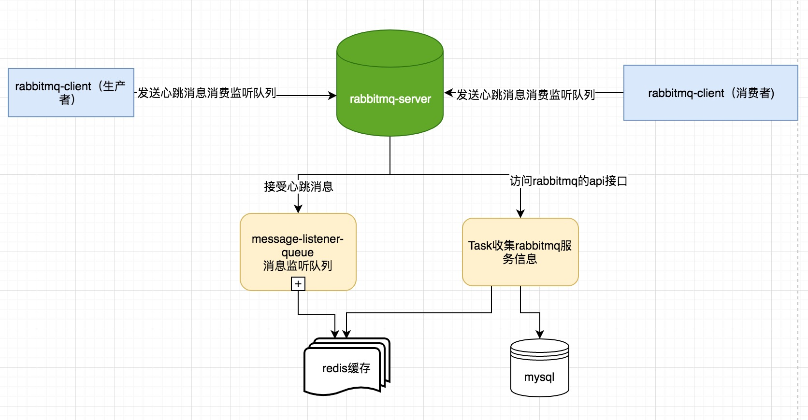
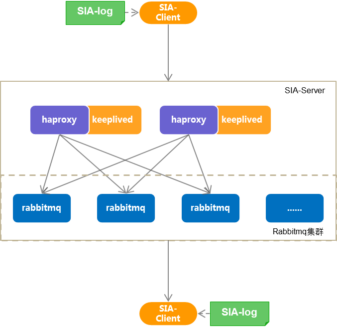
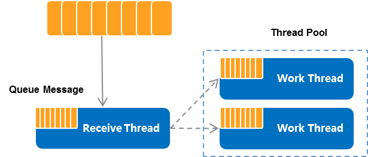
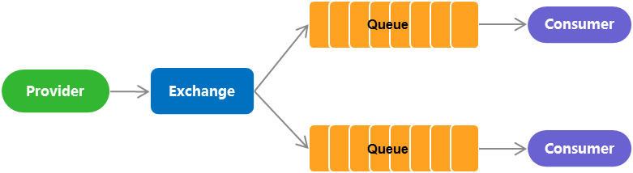
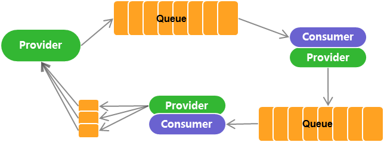
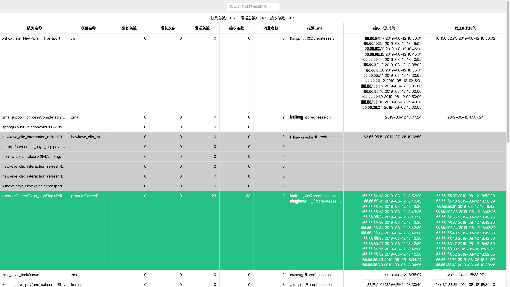

[使用指南](docs/USERSGUIDE.md)     
[开发指南](docs/DEVELOPGUIDE.md)             
[部署指南](docs/DEPLOY.md)             

# 背景
   
&emsp;&emsp;Sia-rabbitmq-plus是公司2013年开发的一个项目。最早只是一个简单的封装好的rabbitmq客户端，随着接入的业务越来越多，业务方提出了很多新的需求。于是我们在rabbitmq的基础上新增了消息队列监控预警提醒，历史消息消费情况查看，详细日志查看，客户端心跳监测等功能，这些功能极大方便了我们查看发现问题，解决问题的效率。
   
# 项目简介

&emsp;&emsp;Sia-rabbitmq-plus工作流程是客户端（生产者或消费者）通过rabbitmq接口发送或者消费消息，同时将客户端元信息（ip，队列名称，项目名称，预警值等）发送给心跳监测队列。
定时任务定时收集rabbitmq相关的队列数据，同时监测预警值发送预警信息。主要包含以下几个模块

1. 客户端（sia-rabitmq-plus-client)   
	主要提供了消费和发送消息的api接口  
2. MQ信息收集模块（sia-rabbitmq-plus-gather)              
   http方式调用rabbitmq的接口采集rabbitmq相关信息   
3. 心跳监测模块 (sia-rabbitmq-plus-heartbeat)  
   收集客户端生产者和消费者的心跳数据
4. 监控前端展示模块(sia-rabbitmq-plus-display)   
   将收集到的mq信息和心跳数据展示在前台页面
    
&emsp;&emsp;监控流程如下：

# RabbitMQ的特性
&emsp;&emsp;消息队列中间件(Message Queue Middleware ，简称为MQ) 是指利用高效可靠的消息传递，机制进行与平台无关的数据交流，并基于数据通信来进行分布式系统的集成。通过提供消息传，递和消息排队模型，它可以在分布式环境下扩展进程间的通信。作为众多消息中间件之一的。RabbitMQ发展到今天被越来越多的人认可，这和它在易用性、扩展性、可靠性和高可用性等方面的卓著表现是分不开的。

&emsp;&emsp;RabbitMQ 的具体特点可以概括为以下几点。

* 可靠性: RabbitMQ 使用一些机制来保证可靠性，如持久化、传输确认及发布确认等。
令灵活的路由: 在消息进入队列之前，通过交换器来路由消息。对于典型的路由功能，
RabbitMQ己经提供了一些内置的交换器来实现。针对更复杂的路由功能，可以将多个
交换器绑定在一起，也可以通过插件机制来实现自己的交换器。
* 扩展性: 多个RabbitMQ节点可以组成一个集群，也可以根据实际业务情况动态地扩展
集群中节点。
* 高可用性: 队列可以在集群中的机器上设置镜像，使得在部分节点出现问题的情况下队
列仍然可用。
* 多种协议: RabbitMQ除了原生支持AMQP 协议，还支持STOMP，MQTT 等多种消息
中间件协议。
* 多语言客户端:RabbitMQ几乎支持所有常用语言，比如Java、Python、Ruby、PHP、
C#、JavaScript 等。
* 管理界面: RabbitMQ提供了一个易用的用户界面，使得用户可以监控和管理消息、集
群中的节点等。
* 插件机制: RabbitMQ提供了许多插件，以实现从多方面进行扩展，当然也可以编写自
己的插件。

# Sia-rabbitmq-plus特性

+ **高可用性**：  

RabbitMQ队列服务集群化，支持动态增删集群节点。 增加镜像队列，预防单点故障。

+ **可收缩性**:  

支持动态增删消费线程以适应消息的处理。每个监听队列都有一个线程池提供服务，用户可自定义消费处理线程池。

+ **易用性**：  

去中心化管理，相关配置信息本地化，简单方便。

+ **消息追踪**

所有收发的消息在本地用单独的日志文件存储，方便数据恢复与排错。

+ **邮件预警**

增加对线上队列的实时监控，触发预警时及时通知到个人。

* **支持三种发送方式**

1 .  `点对点模式`：Provider生产消息发送到队列中，Consumer绑定队列获取消息。

2 . `发布订阅模式`： Provider将消息发送给Exchange，然后Consumer创建Queue绑定到Exchange接收消息。

3 . `同步链条模式`：模拟系统间同步请求调用，实现机制与之前版本完全保持一致，`但不作推荐使用`。

# 监控页面预览
  监控页面可以直观的看到每个队列的消费情况、预警邮箱、接收的ip、发送的ip通过颜色区分队列的健康情况，以及最多7天的历史消息信息。具体查看[使用指南](docs/USERSGUIDE.md)

# Sia-rabbitmq-plus重要指标
 
  * 吞吐量（每秒最大请求量）            
   大概每秒20MB的数据（并发请求也是依次进入队列服务器）一天的最大吞吐量为1728GB。
   
  * 每秒最大的并发量             
   假设每条消息平均10KB，则每秒可以流通的消息数为2000条,一天可以流通的消息为172,800,000 （1亿7千2百8十万）条
   
  * 消息的最大堆积                      
  sia-rabbitMQ-plus的堆积量跟硬盘空间有关，目前SIA搭建的RabbitMQ集群所在的宿主机为8核16G内存256G磁盘。
  据最新的统计，目前单队列最高一天流通1百万条消息

# 关键术语

* exchange：接收发布应用程序发送的消息，并根据一定的规则将这些消息路由到“消息队列”。

* queue：存储消息，直到这些消息被消费者安全处理完为止。

* businessCode: businessCode是两个系统间通讯的的唯一的标示符，对应MQ服务器的queue

* groupCode：发布订阅模式下的交换机，对应MQ服务器的exchange

# SIA相关开源产品链接：
* [微服务任务调度平台](https://github.com/siaorg/sia-task)
* [微服务路由网关（zuul-plus)](https://github.com/siaorg/sia-gateway)

## 关于我们

* 邮件交流：sia.list@creditease.cn

* 提交issue:

* 微信交流：

    
    
（待补充）
