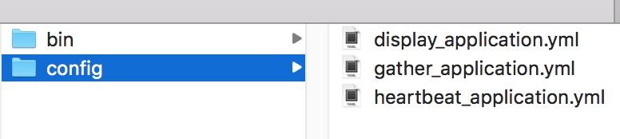
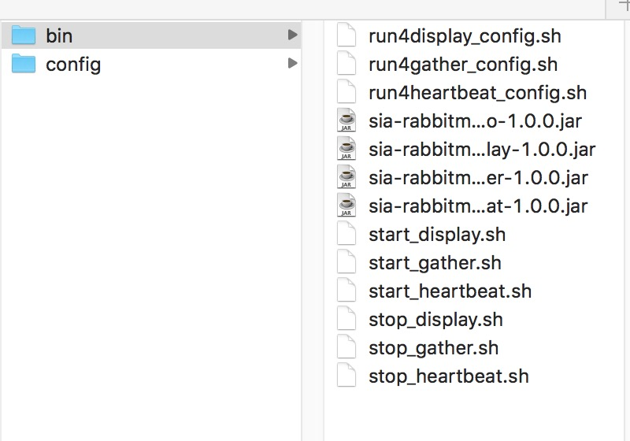
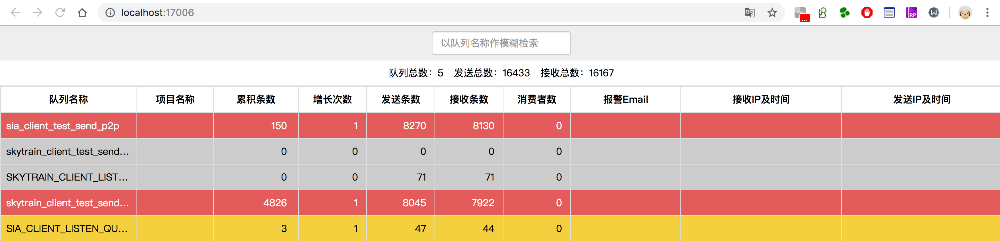

# sia-rabbitmq-plus部署指南

## 一. mysql初始化
```sql
DROP TABLE IF EXISTS `sia_queue_message_info_history`;
CREATE TABLE `sia_queue_message_info_history` (
  `id` int(11) unsigned NOT NULL AUTO_INCREMENT,
  `queue_name` varchar(100) NOT NULL, #队列名称
  `un_consume_message_num` int(11) DEFAULT NULL,#残留消息数量
  `publish_message_num` int(11) DEFAULT NULL,#发送消息数量
  `deliver_message_num` int(11) DEFAULT NULL,# 消费消息数量
  `worktime` timestamp NOT NULL DEFAULT CURRENT_TIMESTAMP,
  PRIMARY KEY (`id`),
  UNIQUE KEY `id_UNIQUE` (`id`),
  KEY `index3` (`queue_name`),
  KEY `index4` (`worktime`)
) ENGINE=InnoDB AUTO_INCREMENT=0 DEFAULT CHARSET=utf8;

```
## 二. redis安装
reids的安装和配置详见官方文档,单机或集群模式都行

## 三. rabbitMQ 安装
rabbitMQ的安装和配置详见官方文档,单机或集群都行

## 项目部署

1.环境要求  
* 系统：64bit OS，Linux/Mac/Windows 
* IDE：推荐使用IntelliJ IDEA 或 Eclipse 
* JDK：JDK1.8+


2.快速启动

从SIA-RABBITMQ-PLUS工程下获取源代码打包，执行rabbitmq-plus-build-component目录的mvn命令即可。

* 在~/sia-rabbitmq-plus/sia-rabbitmq-plus-build-component目录下，执行如下命令打包：mvn clean install 。

* 打包成功后，会在~/sia-rabbitmq-plus/sia-rabbitmq-plus-build-component 目录下出现target文件，target文件中的.zip文件即为项目安装包。

* 打开安装包所在文件夹，将安装包解压，得到task目录，其中包括2个子目录bin和config。bin目录下是工程启动和停止脚本，config是配置文件用于配置mysql和rabbitmq的配置。
目录如图所示：<br>
    <br>
    


3.配置文件修改

将config文件夹下的display_application.yml、gather_application.yml、heartbeat_application.yml 这三个yml文件中的rabbitmq和mysql的链接修改为自己的地址、用户名和密码。

4.启动sia-rabbitmq-plus-heartbeat工程           
sh start-heartbeat.sh

5.启动sia-rabbitmq-plus-gather工程          
sh start-gather.sh

6.启动sia-rabbitmq-plus-display工程      
sh start-display.sh

默认的display_application.yml端口为17006，display工程启动后输入：[http://localhost：17006](http://localhost：17006)  
即可看到sia-rabbitmq-plus监控后台页面。


启动完上述三个工程后，心跳监听队列和收集定时任务以及前端工程都已经准备就绪了，但是没有消息的流通，消费者，发送、接收条数都为0。接下来我们要生产和消费消息。

* 测试方式一：    
&emsp;&emsp; 修改~/sia-rabbitmq-plus/sia-rabbitmq-plus-demo/src/main/resources/siaparameters.properties 文件中的rabbitmq连接参数。
到~/sia-rabbitmq-plus/sia-rabbitmq-plus-demo/src/main/java/com/sia/rabbitmqplus/demo/Application.java 中启动工程。

* 测试方式二：   
&emsp;&emsp;测试方法一中测试的是点对点sendNewP2P的发送和接收在工程启动的时候就执行了。采用单独运行方法的形式启动需
到~/sia-rabbitmq-plus/sia-rabbitmq-plus-demo/src/test/java/com.sia.demo包下修改测试类BaseJunit和ReceiveP2P中文件读取位置。
运行SendP2PTest类中的testSendNewP2P方法和ReceiveP2P类中的main方法就分别启动了生产者和消费者。

工程已经初始化好了生产者和消费者，所以启动后就可以在监控页面看到流通的消息数据，由于后端的数据采集是1分钟采集一次需等候数据刷新。


4.停止工程          
执行 stop-display.sh stop-heartbeat.sh stop-gather.sh 这三个脚本即可
