#rabbitmqPlus监控后台使用说明

#### 1.1 监控后台页面预览

启动sia-rabbitmq-plus-display项目后打开本地地址：http://127.0.0.1:17003即可看到监控页面，监控页面未做权限控制，输入
地址即可看到所有队列的信息。


#### 2.1 术语解释
+ 队列名称：`RabbitMQ`服务器上的队列名

+ 项目名称：用户配置的`PROJECT_NAME`

+ 累积条数：当前队列未消费的消息条数

+ 增长次数：累积条数持续增长的次数

+ 发送条数：之前一分钟内发往队列的消息条数

+ 接收条数：之前一分钟内从队列消费的消息条数

+ 消费者数：从队列接收消息的消费者个数

+ 报警`Email`：接收预警邮件的邮箱名，`SIA5.0`系列版本中，用户配置的`EMAIL_RECEVIERS`

+ 接收`IP`及时间：从队列消费消息的机器`IP`及其最近的消费时间

+ 发送`IP`及时间：向队列发送消息的机器`IP`及其最近的发送时间

+ 队列总数：`RabbitMQ`服务器上的队列名总数

+ 发送总数：之前一分钟发往各队列的消息条数总和

+ 接收总数：之前一分钟从各队列消费的消息条数总和

#### 2.2 队列状态解释
队列健康状态按颜色分为五类：

+ 红色：预警状态，累积条数或增长次数超过用户设定的阈值（累积条数默认阈值为`100`条，增长次数默认阈值为`5`次）。此时已发送预警邮件。


+ 黄色：警告状态，消费者数为零，累积条数大于零。说明有未消费的消息。


+ 灰色：弃用状态，消费者数为零，累积条数也为零。说明队列没有消息流通，可能已废弃。


+ 白色：空闲状态，消费者数大于零，发送条数与接收条数都为零。说明队列暂无消息流通。


+ 绿色：运行状态，消费者数大于零，发送条数与接收条数也都大于零。说明队列有消息流通，收发两端正常通信。


#### 2.3 实时数据查看
##### （1）检索功能
在应用的最上方，有一个检索框：
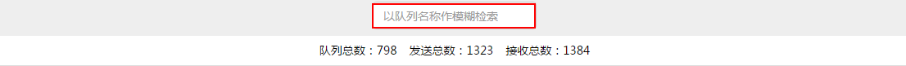
以队列名称做模糊检索，就能查看相应的队列：

##### （2）排序功能
对队列名称、累积条数、增长次数、发送条数、接收条数、消费者数等列提供排序功能。
+ 以发送条数为例，点击发送条数，出现发送条数▲，表示按照升序排序：

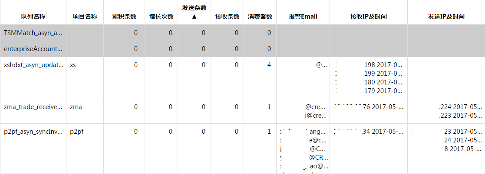

+ 再次点击发送条数，出现发送条数▼，表示按照降序排序：

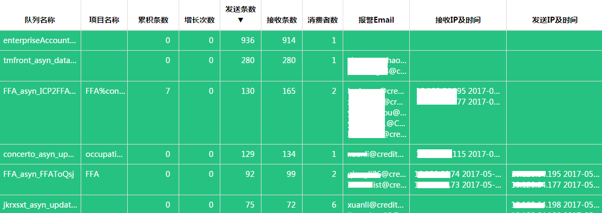

##### （3）检索功能与排序功能可以搭配使用
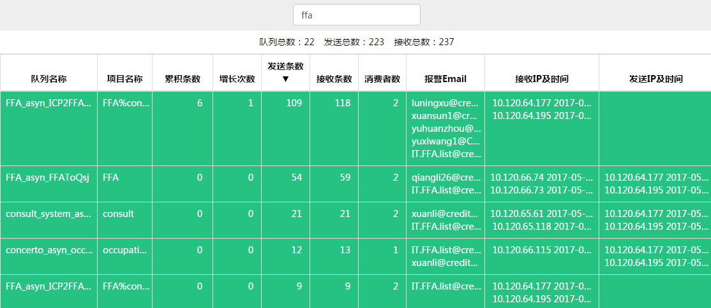

##### （4）点击队列名称这一列下的任意队列，即进入相应队列的历史数据查询界面

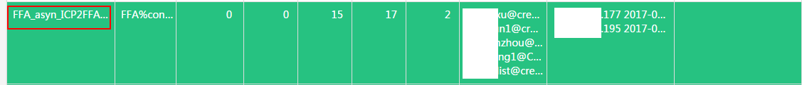


#### 2.4 历史数据查询
##### （1）发送条数与接收条数展示图
按照时间单位，可以展示最近`7`天的历史数据。选择时间单位，设置起始时间与结束时间，点击查看：


+ 分，查看区间为`30`分钟

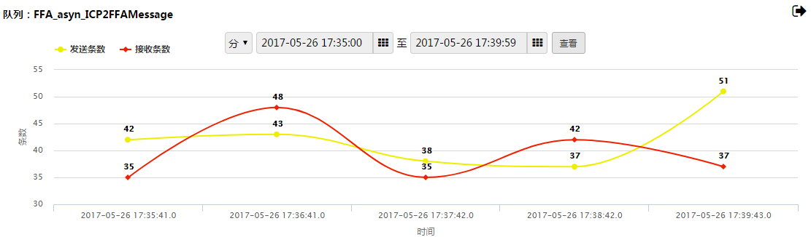

+ 时，查看区间为`30`小时

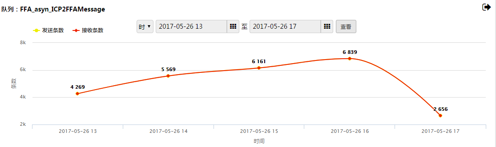

*(发送条数与接收条数重合了)*
+ 日，查看区间为`7`天

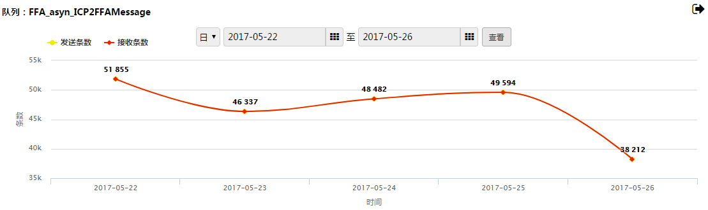

*(发送条数与接收条数重合了)*

如果只想看发送条数（或接收条数），则点击发送条数（或接收条数）进行开启或关闭。

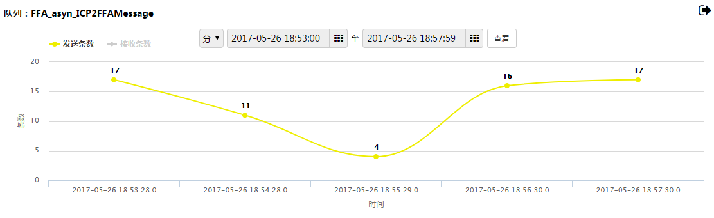

##### （2）累积条数展示图
按照时间单位，可以展示最近`7`天的历史数据。查看区间为`30`分钟。
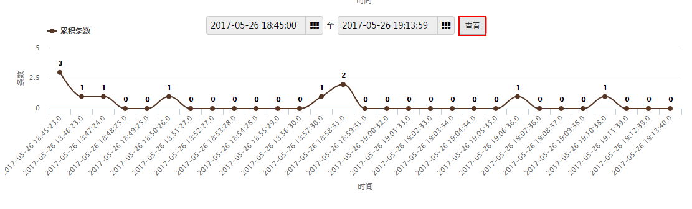

*累积条数不为零说明当时发送条数总数大于接收条数总数。*

点击返回图标，即可回到上一层实时数据查看界面
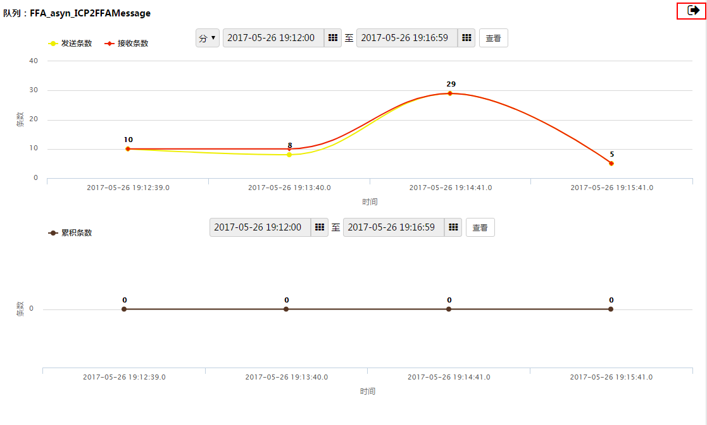

### 3. 队列预警的解释
队列预警邮件示例：
```
剩余消息数：188 报警阈值：1000 增长次数:12 报警增长次数阈值：11
```
解释如下：
```
if(剩余消息数>报警阈值){
    发送预警邮件，说明消费者接收速率慢，需要关注！
}
if(增长次数>报警增长次数阈值){
    发送预警邮件，大概率消费者已经停机，需要立即处理！
}
```